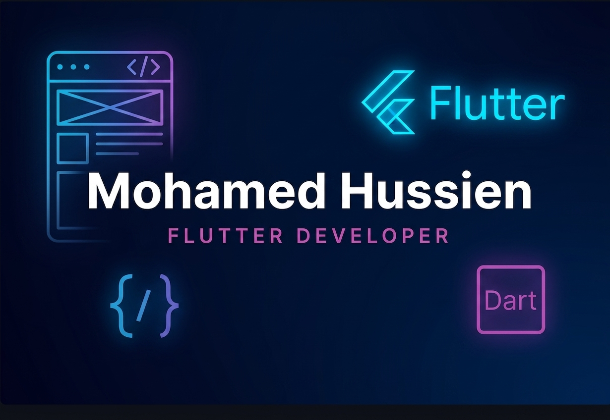

<h1 align="center">Hi 👋, I'm Mohammed Hussien</h1>
<h3 align="center">A passionate Flutter developer from Egypt</h3>

  

  

## 🧠 About Me

🧑‍🎓 Recent graduate from Faculty of Computers and Artificial Intelligence At Benha University 

📱 Specialized in Flutter, Dart, Bloc/Cubit, Firebase, REST APIs and Responsive UI Development 

⚙️ Built multiple mobile applications including e commerce, service booking, and AI integrated solutions

🤝 Collaborated with AI, Web, and Backend (.NET) teams during the development of a full-stack graduation project

🌱 Currently learning Clean Architecture, Advanced State Management, and Flutter Performance Optimization

---

## 📄 Download My CV

  

---

  
  

---

<h3 align="left">Connect with me:</h3>

<h3 align="left">Languages and Tools:</h3>

             

